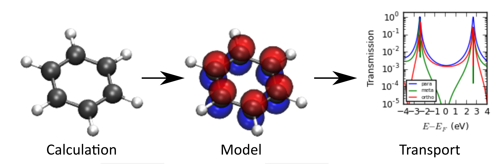

# From computational experiment to quantifiable understanding

This implementation of natural orbitals can be used to e.g.:

1. Extract parameters for H\"uckel-type/tight-binding models. 
2. Calculate the electrical conductance of a molecule from a gas phase calculation. 

# What is it?
natural-orbitals is a Python class written to calculate different types of natural orbitals based on the output of electronic structure codes. 

# How does it work?

Supply the class with input extracted from DFT or HF calculations. Input from [GPAW](https://wiki.fysik.dtu.dk/gpaw/) GPAW is demonstrated and output from Gaussian09 calculations will follow. 

The implementation of natural atomic orbitals (NAO) is based on: 

Reed, A.; Weinstock, R.; Weinhold, F. J. Chem. Phys. 1985, 83 (1985), 735.

Note: Spherical symmetry is not implemented. As a result, the NAOs do not neccesarily resemble s, p or d-orbitals. 

The implementation of natural hybrid orbitals is based on: 

Foster, J. P.; Weinhold, F. J. Am. Chem. Soc. 1980, 102 (22), 7211.

The input in the example is based on a GPAW calculation.